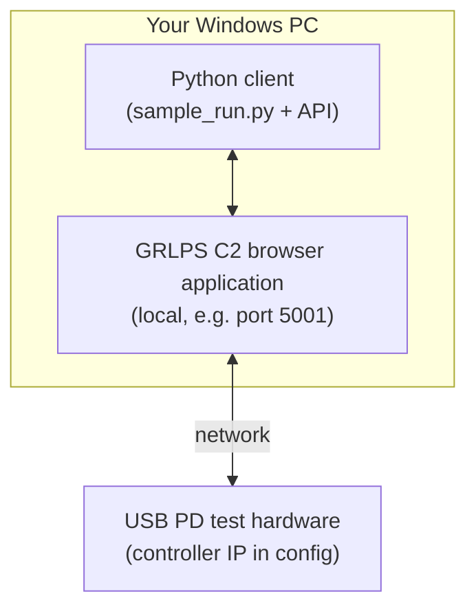
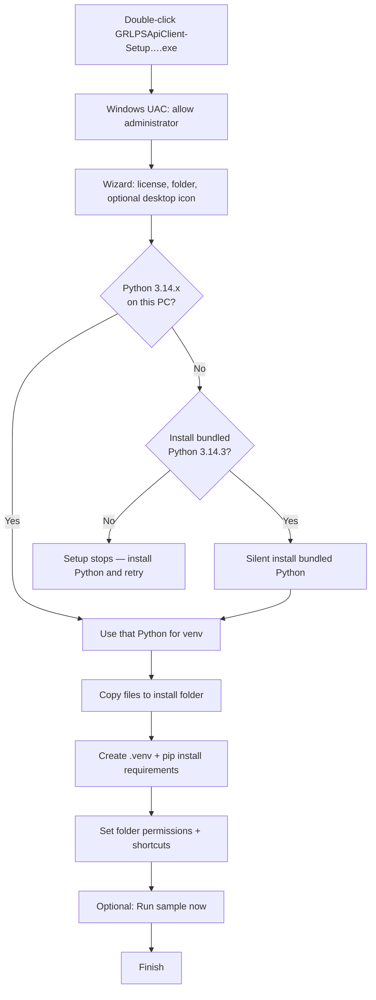
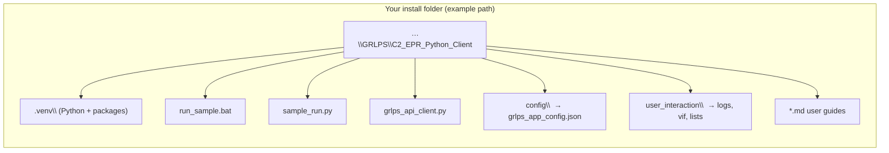
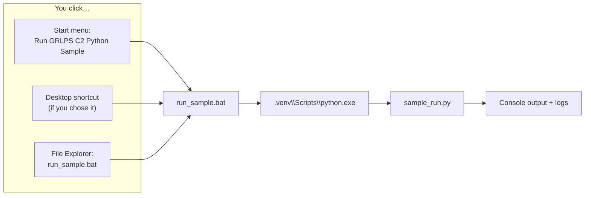
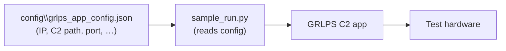

# GRLPS C2 EPR Python Client — install and run (end user)

This guide is for **people who install the Windows setup program** (`GRLPSApiClient-Setup-….exe`). It explains how to install the GRLPS C2 EPR Python API client on your PC and how to run the included sample workflow.

For **daily use of the API** (configuration, workflow steps, return values), see **`GRLPSApiClient_USER_GUIDE.md`** in the same install folder.

**Note on diagrams:** The figures below use [Mermaid](https://mermaid.js.org/) syntax. They render automatically on **GitHub** and in editors with Mermaid preview. If you only see code blocks, follow the numbered steps in each section — the text is complete without the diagrams.

### Diagram — big picture (after install)



The **installer** places the Python client on your PC. You still configure **where C2 is** and **tester IP** in `config\grlps_app_config.json` (see section 6).

---

## 1. What you are installing

- **Product name:** GRLPS C2 EPR Python Client (wording may match the setup wizard).
- **Purpose:** Python scripts can talk to the **GRLPS C2 browser application** on your PC and to your **USB PD test hardware** using the shipped sample and API client.
- **Default install folder (can be changed in setup):**  
  `C:\Program Files\GRLPS\C2_EPR_Python_Client`
- **Shortcuts (after install):**
  - **Start menu** → folder for this app → **Run GRLPS C2 Python Sample**
  - **Start menu** → **Open Install Folder** (opens the install directory)
  - **Desktop** → **Run GRLPS C2 Python Sample** — only if you enabled the optional task *Create a desktop shortcut* during setup.

---

## 2. Before you start

| Requirement | Notes |
|-------------|--------|
| **Windows** | 64-bit Windows (the installer runs in 64-bit mode). |
| **Administrator rights** | The installer needs elevation (UAC prompt) to install under Program Files and configure the environment. |
| **Python 3.14.x** | The client is built for **Python 3.14.x**. If it is **not** already installed, the setup can install a **bundled Python 3.14.3** for you when you agree to the prompt (see section 4). |
| **Internet (recommended)** | After install, setup runs `pip install -r requirements.txt` inside a **local virtual environment**. If your network blocks PyPI, that step may fail — see section 8. |
| **GRLPS C2 application** | For real test runs you still need the C2 browser app installed and paths/IP set in configuration (see section 6 and the main user guide). |

### Diagram — installer wizard flow



---

## 3. Install — step by step

1. **Run the setup file**  
   Double-click **`GRLPSApiClient-Setup-<version>.exe`** (exact name depends on the build version).

2. **Allow administrator access** when Windows asks (User Account Control).

3. **Follow the wizard**  
   - Accept the license if shown.  
   - Choose **installation folder** if you do not want the default (`C:\Program Files\GRLPS\C2_EPR_Python_Client`).  
   - Optionally tick **Create a desktop shortcut** if you want a desktop icon for the sample.

4. **Python check (important)**  
   Setup looks for **Python 3.14.x** on your computer.
   - If **found:** you may see an informational message showing which `python.exe` will be used to create the project’s virtual environment.  
   - If **not found:** setup asks whether to install **bundled Python 3.14.3**. Choose **Yes** to continue, or install Python 3.14.x yourself and run setup again.

5. **Wait for post-install steps**  
   The installer may show status such as:
   - Creating Python virtual environment  
   - Upgrading pip  
   - Installing project dependencies  
   - Validating Python in the virtual environment  
   - Configuring folder permissions (so normal users can write logs and config where needed)  

   Do not close the installer until it finishes.

6. **Optional final screen**  
   You may be offered **Run sample now**. You can run it immediately or start later from the Start menu (section 5).

7. **Finish**  
   Click **Finish** to close the wizard.

---

## 4. What the installer creates on your PC

### Diagram — main folders and files (simplified)



Inside your chosen install folder (default under **Program Files**), you should see (among other items):

| Item | Role |
|------|------|
| `.venv\` | **Virtual environment** with Python and packages used only by this product. Do not delete it if you want to run the sample. |
| `run_sample.bat` | **Launcher** that runs the end-to-end sample using the venv. |
| `sample_run.py` | Sample script: connect, project, VIF, tests, report (see user guide). |
| `grlps_api_client.py` | Public API entry point for your own scripts. |
| `config\` | Configuration files; **`grlps_app_config.json`** is the main file customers edit. |
| `user_interaction\` | Logs, VIF files, test lists, and similar runtime data (created or seeded on first install). |
| `GRLPSApiClient_USER_GUIDE.md` | Full API and workflow documentation (if included in your build). |

**Upgrades:** Your edits to **`config\grlps_app_config.json`** and data under **`user_interaction\`** are designed to be **preserved** when you install a newer version over the old one. Do not rely on this for critical data without backups.

---

## 5. How to run the sample

### Diagram — ways to start the sample



**Recommended (easiest):**

1. Press the **Windows** key, open the **Start** menu.  
2. Find the folder named like **GRLPS C2 EPR Python Client** (or the name shown in setup).  
3. Click **Run GRLPS C2 Python Sample**.

**Alternative:**

1. Open **File Explorer** and go to your install folder, e.g.  
   `C:\Program Files\GRLPS\C2_EPR_Python_Client`  
2. Double-click **`run_sample.bat`**.

**What happens:** A **command window** opens. The sample talks to the C2 app, connects to the tester (using settings in config), runs the demo flow, then exits. If something fails (no connection, missing VIF, etc.), messages appear in the window and in log files under `user_interaction\logs\`.

**Exit code:** If you run from a command prompt, `echo %ERRORLEVEL%` after the batch file finishes shows the script exit code (`0` usually means the script completed without a hard failure; connection or test failures may still be reported inside the returned JSON — see user guide).

---

## 6. Configuration before real lab use

### Diagram — what you edit vs what runs



The installer does **not** know your lab’s IP addresses or where your C2 `.exe` is installed. **Edit** (with Notepad or another editor):

`config\grlps_app_config.json`

Typical settings to verify (names may vary slightly by version):

- **`selectedApp`** and **`applications.<name>.ip_address`** — IP address of the **test hardware / controller** on your network.  
- **`applications.<name>.app_path`** — Full path to the **C2 browser application** executable on this PC.  
- **`applications.<name>.known_port`** — Local HTTP port the C2 app uses (often `5001`).  
- **`common.vifDir`**, **`common.selectedVifFile`** or paths used by your scripts — where VIF XML files live.  
- **`common.testListToExecuteFile`** — JSON file listing tests to run for the sample.  
- **`common.reportExportDir`** — Where report copies should be written.

Detailed explanations and examples are in **`GRLPSApiClient_USER_GUIDE.md`**.

### `run_testcases(...)` quick reference (with examples)

Use this after `start_app()`, `connect()`, `create_project()`, `load_vif()`, and `send_test_list()`.

#### Input parameters

| Parameter | Default | Meaning |
|-----------|---------|---------|
| `timeout_sec` | `15000` | Max seconds to wait for completion (~4h 10m) |
| `poll_interval_sec` | `1.0` | Delay between progress polls |
| `progress_full_states_max` | `32` | Threshold for optional verbose per-test progress output |
| `progress_current_max_len` | `None` | If not set, full `current=` testcase name is shown (no truncation) |
| `progress_show_states` | `True` | Show extra per-test state details in logs |

#### Runtime behavior notes

- **Stall detection:** uses `common.stallTimeoutSeconds` in `grlps_app_config.json` (default `300` if omitted). While `appState` is `BUSY`, the effective threshold is doubled (2x).
- **Diagnostics:** if `GetTestResults` fails repeatedly, client may call `GetAllChannelData` as a throttled diagnostic (not normal progress path).
- **Debug JSON:** writing `user_interaction/logs/test_results.json` is controlled by `create_get_test_results_json` in `services/grlps_api_client_core.py` (default `False`). When `False`, `testResultsJsonPath` in response is `null`.

#### Example 1 — standard run (recommended)

```python
from grlps_api_client import GRLPSApiClient

client = GRLPSApiClient()
client.start_app()
client.connect()
client.create_project()
client.load_vif()
client.send_test_list()

run_payload = client.run_testcases(
    timeout_sec=900,
    poll_interval_sec=1.0
)
print(run_payload.get("success"), run_payload.get("message"))
```

#### Example 2 — verbose progress

```python
run_payload = client.run_testcases(
    timeout_sec=1200,
    progress_show_states=True,
    progress_full_states_max=50
)
```

#### Example 3 — faster polling for UI feedback

```python
run_payload = client.run_testcases(
    timeout_sec=600,
    poll_interval_sec=0.5,
    progress_current_max_len=80
)
```

---

## 7. How to uninstall

1. Open **Windows Settings** → **Apps** → **Installed apps** (or **Control Panel** → **Programs and Features**).  
2. Find **GRLPS C2 EPR Python Client** (or the name shown in setup).  
3. Choose **Uninstall** and follow the prompts.

**Note:** Folders marked to keep user data may remain under the old install path; you can delete the install folder manually if the uninstaller leaves an empty or partial directory.

---

## 8. Troubleshooting

| Problem | What to try |
|---------|-------------|
| **“Python virtual environment not found”** when running `run_sample.bat` | The `.venv` folder is missing or broken. Run **Repair** from Apps settings if available, or uninstall and reinstall. Ensure setup completed without errors. |
| **Setup says Python 3.14.x is required** | Install Python **3.14.x** (64-bit), or accept the offer to install the **bundled** Python from the installer. |
| **`pip install` failed during setup** | Check internet access and proxy/firewall. Re-run setup after fixing the network, or open **Command Prompt as Administrator**, `cd` to the install folder, and run:  
  `.venv\Scripts\python.exe -m pip install -r requirements.txt` |
| **Sample runs but cannot connect** | C2 app must be running; `grlps_app_config.json` must have the correct **controller IP** and **app path**. Firewall must allow local access to the C2 port. |
| **Permission errors writing logs or config** | The installer applies permissions for standard users; if you moved the install folder manually, reinstall or ask IT to grant **Modify** on `user_interaction` and `config` for your user. |
| **“Run sample” flashes and closes** | Open **Command Prompt**, `cd` to the install folder, run `run_sample.bat`, and read the error text. |

For **API behavior**, payloads, and step-by-step scripting, use **`GRLPSApiClient_USER_GUIDE.md`**.

---

## 9. Document map

| Document | Audience |
|----------|----------|
| **This file** (`GRLPSApiClient_INSTALLER_END_USER_GUIDE.md`) | End users installing from **Setup.exe** |
| **`GRLPSApiClient_USER_GUIDE.md`** | End users and integrators using the **Python API** |
| **`INSTALLER_IMPLEMENTATION_GUIDE.md`** | Internal — how the installer is **built** (maintainers only) |

---

*If your IT department distributes a repackaged or silent install, follow their instructions; the paths and shortcut names above may differ.*
