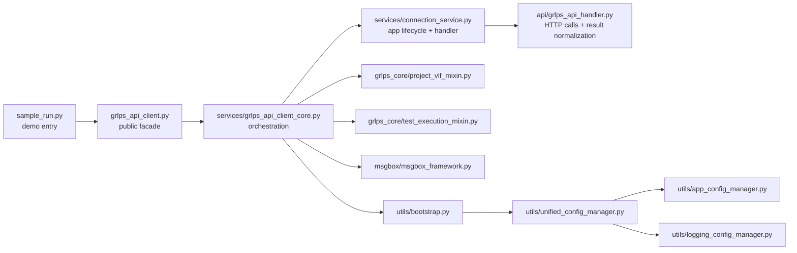
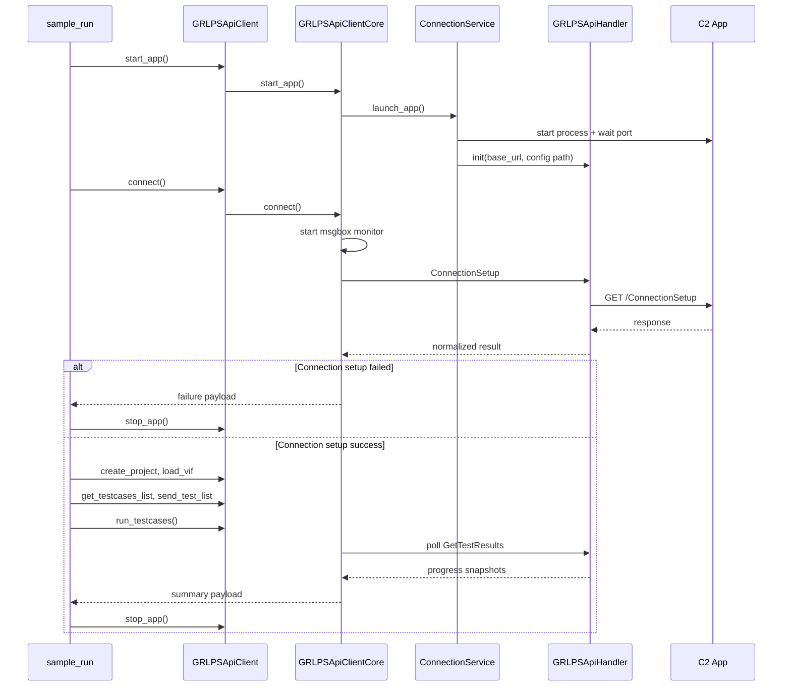
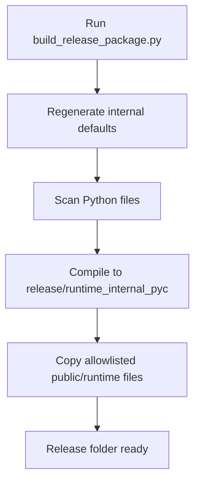
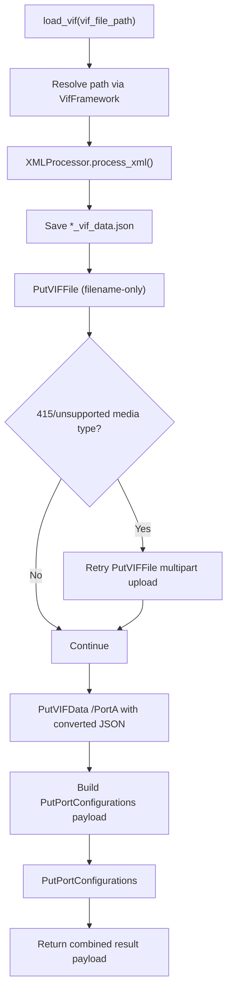
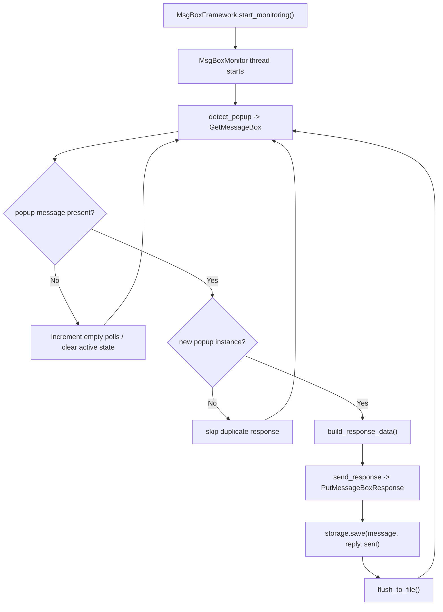
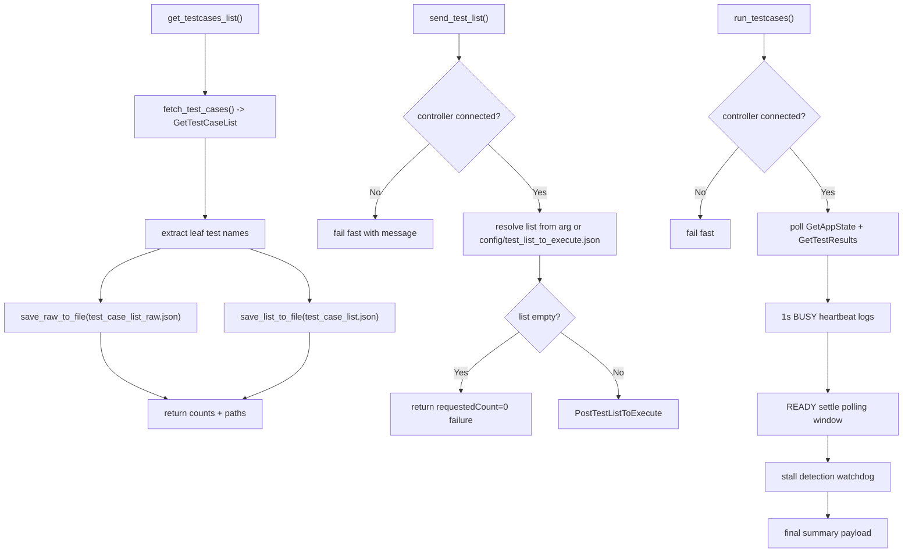

# GRLPS API Client Programmer Guide (Internal)

This guide is for developers maintaining and extending the GRLPS API client codebase.
It is intentionally technical and is **not** intended for end users.

---

## 1) Project Intent

The project provides a Python automation client for GRLPS C2 app workflows:

- Launch app and connect to tester
- Create project and load VIF
- Fetch test cases and submit selected tests
- Poll execution progress and return summarized results
- Handle popup message boxes in the background

Design goals:

- Keep public API simple (`grlps_api_client.py`)
- Keep implementation modular (`services`, `api`, `grlps_core`, `utils`)
- Keep runtime behavior deterministic for both source and release bundles
- Support customer release without shipping internal JSON/source details

---

## 2) Runtime Requirements Enforcement

The client currently enforces strict runtime compatibility in `grlps_api_client.py`.

Required runtime:

- OS: `Windows`
- Python: `3.14.x` (major=3, minor=14)

Implementation notes:

- `_validate_runtime_requirements()` runs at module import time.
- Compatible runtime proceeds normally.
- Incompatible runtime raises `RuntimeError` with current OS and Python details.
- This is intentionally early-fail so unsupported environments are rejected before partial initialization.

If requirement changes in future:

1. update `_validate_runtime_requirements()` in `grlps_api_client.py`
2. update this guide
3. update `GRLPSApiClient_USER_GUIDE.md`
4. re-test both source and release execution

---

## 3) High-Level Architecture



---

## 4) Runtime Flow



---

## 5) Key Modules and Responsibilities

- `grlps_api_client.py`
  - Public facade exposed to users.
  - Injects release runtime context (`GRLPS_API_PROJECT_ROOT`) and `runtime_internal_pyc` import preference.

- `services/grlps_api_client_core.py`
  - Main orchestrator combining mixins.
  - Owns lifecycle state (`_controller_connected`, msgbox monitoring, config/log manager).

- `services/connection_service.py`
  - App launch/ensure/stop behavior and API handler bootstrap.
  - Computes default API config path from runtime root.

- `api/grlps_api_handler.py`
  - HTTP GET/POST/PUT execution, result wrapping, logical failure interpretation.
  - Handles VIF path behavior and optional consolidated `GetTestResults` debug JSON.

- `grlps_core/project_vif_mixin.py`
  - Project creation and VIF upload/config APIs.

- `grlps_core/test_execution_mixin.py`
  - Test list retrieval/submission and execution polling loop.
  - 1-second progress heartbeat during BUSY state.
  - Stall detection and ready-settle polling logic.
  - Fail-fast guard when controller is not connected.

- `msgbox/*`
  - Background monitor for popups and automatic responses.
  - Persists interaction logs.

- `utils/bootstrap.py`
  - Initializes config and logging managers.
  - Resolves runtime root safely for source and release layouts.

---

## 6) Source vs Release Path Strategy

The runtime root resolver supports both:

- source tree execution
- release execution (`release/runtime_internal_pyc`)

Rules:

1. Prefer `GRLPS_API_PROJECT_ROOT` env value when present.
2. Otherwise derive root from module location.
3. If derived root ends with `runtime_internal_pyc`, map to its parent (`release`).

This avoids accidental path leakage into developer repository directories during release runs.

---

## 7) Configuration Model

Customer-facing:

- `config/grlps_api_config.json`

Internal defaults fallback (release-safe):

- `utils/app_defaults.py` (generated)
- `utils/logging_defaults.py` (generated)

Internal source JSON (not required in customer release):

- `config/grlps_app_config.json`
- `config/logging_config.json`

Generation tool:

- `tools/generate_internal_defaults.py`

---

## 8) Release Build Workflow



Release tool:

- `tools/build_release_package.py`

**Maintainer-only build reference (files, functions, installer flow):** `BUILD_PROCESS_CODER_GUIDE.md`

Config file:

- `tools/release_package_config.json`

Current controls:

- `releaseDir`
- `pycSubDir`
- `cleanReleaseDir`
- `excludeDirs`
- `excludeFolderDetails`
- `includePyFiles`
- `includeJsonFiles`
- `includeFiles`
- `includeExtraFiles` — optional; any extra project-relative paths to copy (e.g. `GRLPSApiClient_USER_GUIDE.md` at repo root, or `docs/Note.md` under a subfolder). Same path rules as other include lists.

Notes:

- Keep allowlist explicit for files needed at runtime (example: VIF XML, test list JSON).
- Exclude internal folders via generic exclusion keys, not hardcoded tool-specific switches.

---

## 9) Coding Conventions

- Keep facade (`grlps_api_client.py`) simple and stable.
- Return JSON-serializable dicts from public methods.
- Use `ApiResult` + `api_result_to_json_dict` for consistent API shapes.
- Prefer additive changes in mixins/services over large cross-cutting rewrites.
- Keep logging structured, concise, and actionable.
- When adding paths, always use runtime-root-aware resolution.

---

## 10) Error-Handling Conventions

- Distinguish:
  - transport failure (HTTP/non-200)
  - logical failure (HTTP 200 + `success=false` or domain-specific failure markers)
- Return failure payloads with clear `message`/`error`.
- Fail fast for invalid preconditions (example: disconnected controller before test run).
- Keep warning logs for recoverable conditions; error logs for hard failures.

---

## 11) Test Execution Behavior

`run_testcases()` currently includes:

- Polling with `poll_interval_sec` (default 1.0)
- 1-second BUSY heartbeat progress logs
- READY settle polling to avoid premature 0/0 finalization
- Stall watchdog (`stallTimeoutSeconds`, default 300)

Success requires:

- not timed out
- not stalled
- completed state reached
- results completeness confirmed when expected total > 0

---

## 12) VIF to JSON Conversion Framework (Deep Dive)

Primary files:

- `vif/xml_processor.py`
- `vif/vif_framework.py`
- `grlps_core/project_vif_mixin.py`

Purpose:

- Convert VIF XML into API-compatible JSON for `PutVIFData`
- Save converted JSON for verification
- Apply VIF to app in the correct API sequence



### 11.1 `XMLProcessor` data model mapping

`XMLProcessor.process_xml()` outputs:

- `nonComponentVIFElements`
  - Top-level VIF metadata (`Vendor_Name`, `VIF_Specification`, etc.)
- `vifproductFields`
  - list containing:
    - `staticProductFields`
    - `USB4Routers`
- `vifComponents`
  - each component contains:
    - `staticPortElements`
    - `sourcePDOs`
    - `sinkPDOs`
    - `sVIDs`
    - `cableSVIDs`
    - `OptionalContent`

### 11.2 Conversion details and helpers

- `convert_value()`
  - Converts `"true"/"false"` to `1/0`
  - Converts numeric text to integer when possible
- `convert_decoded_value()`
  - Produces human-readable decoded strings (`YES/NO`, extracted numeric text for voltage/current style fields)
- `_extract_pdo_list()`
  - Normalizes Source/Sink PDO blocks into indexed map (`"1"`, `"2"`, ...)
- `_extract_svid_dict()`
  - Extracts SVID/CableSVID with nested mode subfields

### 11.3 Port configuration derivation

`ProjectVifMixin._build_port_config_from_vif()` derives part of `PutPortConfigurations` from converted VIF:

- `PD_Port_Type` drives provider/consumer mapping
- `Type_C_State_Machine` drives `stateMachineType`
- Keeps known HAR-aligned constants (`executionMode`, `cableType`, etc.)

### 11.4 Failure modes

- XML parsing error -> `success: false` with conversion message
- Missing VIF file -> `success: false` + path hint
- `PutVIFFile` filename-only mode unsupported -> multipart retry
- Any downstream API failure reflected in per-step payload (`putVIFFile`, `putVIFData`, `putPortConfigurations`)

---

## 13) Message Framework (Deep Dive)

Primary files:

- `msgbox/msgbox_framework.py`
- `msgbox/msgbox_monitor.py`
- `msgbox/msgbox_detector.py`
- `msgbox/msgbox_responder.py`
- `msgbox/msgbox_storage.py`

Purpose:

- Poll popup API in background thread
- Respond once per active popup instance
- Persist message/reply audit log



### 12.1 De-dup and stability behavior

`MsgBoxMonitor` keeps active popup state:

- normalizes message text (`NFKC`, whitespace collapse, printable filtering)
- compares with fuzzy containment matching
- responds once for same active message
- clears active state only after configurable consecutive empty polls (default 2) to avoid flicker duplicates

### 12.2 Detector behavior

`detect_popup()`:

- calls `GET_MESSAGE_BOX`
- validates API success and response structure
- treats `message: null` or empty string as no active popup
- returns popup dict only when actionable

### 12.3 Responder payload contract

`build_response_data()`:

- Builds C2-compatible payload for `PutMessageBoxResponse`
- Uses `popID` (or falls back to `index`)
- Normalizes button value (`OK` -> `Ok`) to match expected API style

`send_response()`:

- executes API call and validates response success flag
- logs warnings on transport/logical failures

### 12.4 Storage behavior

`MsgBoxStorage`:

- Thread-safe append
- Immediate flush after each save (important for short-lived scripts)
- Maintains JSON array log file
- Creates log directory as needed

---

## 14) Test Framework (Deep Dive)

Primary files:

- `test_cases/test_cases_framework.py`
- `test_cases/test_cases_fetcher.py`
- `test_cases/test_cases_storage.py`
- `grlps_core/test_execution_mixin.py`
- `grlps_core/test_results_progress.py`

Scope:

1. Fetch available test catalog
2. Save raw and normalized test list artifacts
3. Submit selected tests
4. Poll execution progress and finalize run summary



### 13.1 Test list extraction logic

`test_cases_fetcher._extract_test_case_names()`:

- Traverses tree structure recursively (`children`)
- Leaf node = node with empty/missing `children`
- Preferred display key order:
  - `key`
  - `title`
  - `displayString`
- Handles list and dict response styles

### 13.2 Saved artifacts

- `test_case_list_raw.json`
  - full raw API structure from `GetTestCaseList`
- `test_case_list.json`
  - normalized array of test names only

Both paths are configurable via `common.testCasesDir`, `testCasesJsonName`, `testCasesRawJsonName`.

### 13.3 Execution loop behavior

`run_testcases()` key points:

- Uses expected total from selected list/config
- Tracks progress via `test_results_progress.extract_test_progress()`
- Prints progress every 1 second during BUSY
- Performs READY settle loop to wait for final results hydration
- Detects no-progress stall via signature/time watchdog
- Optional debug file generation controlled by `create_get_test_results_json`

### 13.4 Success/failure semantics

Run considered successful when:

- no timeout
- no stall
- execution completed
- result completeness is satisfied

Guardrails:

- `send_test_list()` and `run_testcases()` fail fast when controller is not connected

---

## 15) Sample Runner Behavior

`sample_run.py`:

- Uses `VERBOSE_PAYLOADS` toggle for payload printing
- Stops early if `connect().connectionSetupSuccess` is `false`
- Returns structured output dictionary for automation integration

Recommended default for internal automated runs:

- `VERBOSE_PAYLOADS = False`

Recommended default for debugging:

- `VERBOSE_PAYLOADS = True`

---

## 16) Typical Dev Tasks

Refresh defaults from internal JSON:

```bash
python tools/generate_internal_defaults.py
```

Build release package:

```bash
python tools/build_release_package.py --config tools/release_package_config.json
```

Run sample:

```bash
python sample_run.py
```

Run release sample:

```bash
python release/sample_run.py
```

---

## 17) Troubleshooting Checklist

- Release writes outside `release/`:
  - verify runtime root resolver and `GRLPS_API_PROJECT_ROOT`
  - verify `runtime_internal_pyc` path mapping

- `send_test_list` returns 0:
  - verify `config/test_list_to_execute.json` exists in release
  - verify allowlist includes this file

- VIF load fails:
  - verify VIF file copied to release `user_interaction/vif`
  - verify `selectedVifFile` or explicit sample argument

- Long run with no progress:
  - verify tester connection and licensing/calibration state
  - inspect stall timeout behavior and app-state transitions

- Connection setup warnings:
  - inspect controller firmware/license/calibration fields in payload
  - these are equipment/state issues, not packaging issues

---

## 18) Safe Extension Points

Preferred places for new features:

- API endpoint additions: `api/api_enum.py` + `config/grlps_api_config.json` + handler logic only if special behavior needed
- New execution strategies: `grlps_core/test_execution_mixin.py`
- New project/VIF workflows: `grlps_core/project_vif_mixin.py`
- New release controls: `tools/release_package_config.json` + `tools/build_release_package.py`

Avoid:

- Embedding environment-specific absolute paths in code
- Adding user-facing config keys to internal-only behavior without explicit requirement

---

## 19) Maintenance Notes

- Keep this guide updated whenever architecture, runtime path rules, or release controls change.
- When adding a customer-facing behavior, update both:
  - `GRLPSApiClient_USER_GUIDE.md` (end-user)
  - this programmer guide (internal implementation details)

