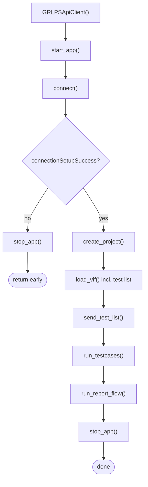
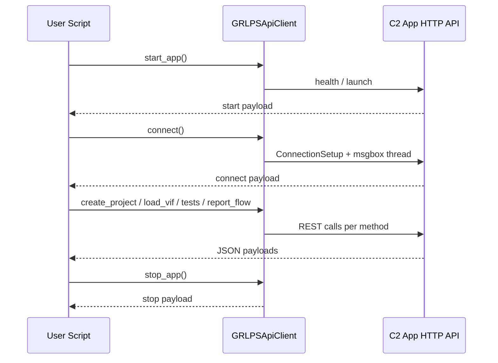

# GRLPSApiClient User Guide

End-user guide for `grlps_api_client.py` and the recommended sample script `sample_run.py`.

**Installed from the Windows setup program?** Start with **`GRLPSApiClient_INSTALLER_END_USER_GUIDE.md`** (how to install, run `run_sample.bat`, and open the install folder). This file focuses on configuration and API usage after Python is available.

All public methods that return a **dict** use JSON-friendly values so you can use `json.dumps(..., ensure_ascii=False)` for logs or files.

---

## Runtime requirements

| Requirement | Value |
|-------------|--------|
| OS | Windows |
| Python | **3.14.x** (major.minor must be 3.14) |

On import, `grlps_api_client` prints a line to **stderr** when the check passes, for example:

`[grlps_api_init] Runtime check passed | expected: Windows + Python 3.14.x | current: Python 3.14.3 on win32`

If incompatible, a `RuntimeError` is raised before your script runs further.

---

## Configuration (what the end user gets)

The filenames `grlps_api_config.json` and `grlps_app_config.json` differ by one word — **confirm your distribution policy with the release owner** if documentation and packaging ever disagree.

**Customer / end-user packages ship only one editable JSON for application behavior:**

| File | End user may edit? | Role |
|------|--------------------|------|
| `config/grlps_app_config.json` | **Yes** | `selectedApp`, `applications.*` (EXE path, `known_port`, controller `ip_address`), `common.*` (project folder name, VIF paths, test list file path, `stallTimeoutSeconds`, **`reportExportDir`**, msgbox log paths, delays, etc.). |

**Not given to end users (internal / inside the shipped build):**

| Item | Notes |
|------|--------|
| `config/grlps_api_config.json` | Maps each `ApiName` to HTTP method and URL template. Kept **internal** (embedded defaults or `.pyc`); customers do **not** edit route tables. |
| `config/logging_config.json` | Log levels and log file layout — **internal**; not a customer deliverable. |

**Report export:** set `common.reportExportDir` in **`grlps_app_config.json`** to the folder where HTML/PDF should be copied. If that path is missing or not writable, the client falls back to `user_interaction/reports_export` and logs a warning.

**Default test list:** `send_test_list()` with no arguments loads the file pointed to by `common.testListToExecuteFile` (for example `config/test_list_to_execute.json`) unless you pass an explicit list in code.

---

## Normalized API result (inside many return dicts)

Any method that wraps a single HTTP call (including nested fields like `putProjectFolder`, `connectionSetup`, `postTestListToExecute`, and each report sub-key) uses this **same shape** under `data`:

```json
{
  "success": true,
  "resultType": "success",
  "error": null,
  "warning": null,
  "data": {
    "api_name": "ConnectionSetup",
    "request": {
      "method": "GET",
      "url": "http://127.0.0.1:5001/api/ConnectionSetup/0/192.0.2.50",
      "params": null,
      "data": null
    },
    "response": {
      "status_code": 200,
      "success": true,
      "data": {},
      "content_type": "json"
    }
  }
}
```

- **`response.data`** holds the server JSON body (structure depends on the API). For `ConnectionSetup` it is often large (firmware, licenses, tester status, etc.).
- On failure, `success` is `false`, `resultType` is `"failure"`, and `error` / `data` contain diagnostics.

---

## End-to-end workflow (code reference: `sample_run.py`)

### What is optional vs required

- **`get_testcases_list(save_to_disk=True)`** — **Optional.** After a normal `load_vif(...)` (default `fetch_testcases_after=True`), the test list is already fetched and saved; you do **not** need a separate `get_testcases_list()` unless you want to **refresh** the list without reloading the VIF.
- **Granular report methods** (`get_report_inputs`, `update_report_inputs`, `get_test_run_info`, `get_results_folder_name`, `get_report_file_name`, `get_report_path_status`, `build_report_url`) — **Optional.** They are for custom integrations. You do **not** have to call them if you use **`run_report_flow()`**, which runs the report sequence and export in one step.
- **`run_report_flow()`** — **Use this** when you want the client to drive reports end-to-end (update inputs, query run info, resolve folders, copy HTML/PDF to `common.reportExportDir`). Treat it as the **standard** report step in your script; the lower-level report APIs above are alternatives, not prerequisites.

### Call order

| Step | Code | Purpose |
|------|------|---------|
| 1 | `client = GRLPSApiClient()` | Bootstrap config + logging; runtime check |
| 2 | `client.start_app()` | Ensure local C2 app is up; get `baseUrl` |
| 3 | `client.connect()` | Start popup monitor; **ConnectionSetup** to controller |
| 4a | If `not connect_payload["connectionSetupSuccess"]` | `stop_app()` and **exit early** (skip project/VIF/tests/report) |
| 4b | `client.create_project(project_name="Demo")` | Put project folder name |
| 5 | `client.load_vif(vif_file_path="....xml")` | Upload VIF, PutVIFData, PutPortConfigurations; **by default** also fetches the test list and merges `testCasesListSuccess`, `testCaseCount`, and JSON paths into the **same** return dict (no second call) |
| 6 | `client.send_test_list()` | Post list from `common.testListToExecuteFile` in `grlps_app_config.json` (or pass a list in code) |
| 7 | `client.run_testcases(timeout_sec=15000, poll_interval_sec=1.0)` | Poll until READY / timeout / stall |
| 8 | `client.run_report_flow()` | **Standard report step:** runs ReportsGeneration APIs + copies HTML/PDF to `common.reportExportDir` (see `grlps_app_config.json`). Prefer this over calling individual report APIs yourself. |
| 9 | `client.stop_app()` | Stop monitor; stop app only if this client launched it |

**Optional extra:** `client.get_testcases_list(save_to_disk=True)` only if you need a fresh list after VIF load without calling `load_vif` again.

### Sample input files for sample_run.py

Paths are relative to the **project root** (the folder that contains `grlps_api_client.py` and `config/`).

| File | Set in | Role |
|------|--------|------|
| **`config/test_list_to_execute.json`** | `common.testListToExecuteFile` in **`grlps_app_config.json`** (default: `"config/test_list_to_execute.json"`) | JSON **array** of test display strings; loaded when you call `send_test_list()` with no arguments |
| **`user_interaction/vif/example_captive_cable.xml`** | Passed explicitly in the sample as `load_vif(vif_file_path="example_captive_cable.xml")` | Example VIF XML (sample script does not rely on `common.selectedVifFile` for this path) |

**`config/test_list_to_execute.json`** (shipped sample — four tests):

```json
[
  "TEST.PD.PROT.SRC.1 Get_Source_Cap Response",
  "TEST.PD.PROT.SRC.2 Get_Source_Cap No Request",
  "TEST.PD.PROT.SRC.3 Sender Response Timer Deadline",
  "TEST.PD.PROT.SRC.4 Reject Request"
]
```

To run a different suite, edit this file (or point `common.testListToExecuteFile` at another JSON file with the same **array-of-strings** shape), or call `send_test_list(test_list=[...])` in code.

### Sample code (same structure as `sample_run.py`)

```python
from __future__ import annotations

import json
import sys
from grlps_api_client import GRLPSApiClient

VERBOSE_PAYLOADS = True  # set True to print each step JSON to stderr

def _print_payload(step_name: str, payload) -> None:
    if not VERBOSE_PAYLOADS:
        return
    print(f"{step_name} response:", file=sys.stderr, flush=True)
    print(json.dumps(payload, indent=2, ensure_ascii=False), file=sys.stderr, flush=True)

def main() -> dict:
    client = GRLPSApiClient()
    start_payload = client.start_app()
    _print_payload("start_app", start_payload)

    connect_payload = client.connect()
    _print_payload("connect", connect_payload)

    if not bool(connect_payload.get("connectionSetupSuccess")):
        stop_payload = client.stop_app()
        _print_payload("stop_app", stop_payload)
        return {
            "start_app": start_payload,
            "connect": connect_payload,
            "stop_app": stop_payload,
            "skippedAfterConnectFailure": True,
            "skipReason": "ConnectionSetup did not succeed; skipped project/vif/test execution steps.",
        }

    create_project_payload = client.create_project(project_name="Demo")
    _print_payload("create_project", create_project_payload)

    load_vif_payload = client.load_vif(vif_file_path="example_captive_cable.xml")
    _print_payload("load_vif", load_vif_payload)

    send_test_list_payload = client.send_test_list()
    _print_payload("send_test_list", send_test_list_payload)

    run_testcases_payload = client.run_testcases(
        timeout_sec=120,
        poll_interval_sec=1.0,
    )
    _print_payload("run_testcases", run_testcases_payload)

    report_payload = client.run_report_flow()
    _print_payload("run_report_flow", report_payload)

    stop_payload = client.stop_app()
    _print_payload("stop_app", stop_payload)

    return {
        "start_app": start_payload,
        "connect": connect_payload,
        "create_project": create_project_payload,
        "load_vif": load_vif_payload,
        "send_test_list": send_test_list_payload,
        "run_testcases": run_testcases_payload,
        "run_report_flow": report_payload,
        "stop_app": stop_payload,
    }

if __name__ == "__main__":
    main()
```

Run from the project root:

`python sample_run.py`

To print each step’s return dict as JSON to **stderr** (as in the samples below), set in `sample_run.py`:

`VERBOSE_PAYLOADS = True`

---

## What you see in a typical log (console + session log)

The following matches a verified end-to-end run (2026-03-28); exact paths, IPs, and timings depend on your machine.

### Checklist: healthy full sample run

| Check | Meaning |
|--------|---------|
| `[grlps_api_init] Runtime check passed` | Windows + Python 3.14.x OK |
| `connectionSetupSuccess`: **true** in `connect` payload | Tester reachable at `applications.<app>.ip_address` |
| `create_project` → `success`: **true** | Project folder created on controller |
| After VIF: `Completed: GetTestCaseList` | Post-VIF test list fetch ran (default `load_vif` behavior) |
| `testCasesListSuccess`: **true**, `testCaseCount` & list paths present | List saved under `user_interaction/test_cases_list/` |
| `send_test_list` → `success`: **true** | `PostTestListToExecute` accepted the configured list |
| `[run_testcases] run complete: ... timedOut=False stalled=False` | Run finished in **READY** (or expected terminal state) |
| `[report_flow] completed` / `exportSuccess=True` | Report workflow and copy-to-export-dir succeeded |
| Process exit code **0** | Script returned normally |

**Normal variations:** `App already running on port 5001` and `externallyManagedRunning: true` on `stop_app` when the C2 app was started outside the script. A msgbox line such as `Test execution is already in progress` during `PostTestListToExecute`, followed by `PutMessageBoxResponse`, is auto-handled. `preferred source folder missing; using latest existing run folder` during report export can still yield a successful copy.

### Log sequence (stderr / session log)

1. **Init:** `Starting API framework initialization...`, `GRLPS API Client initialized`.
2. **App:** `App already running on port 5001` or launcher starts the EXE; then `Application launched at http://127.0.0.1:5001`.
3. **connect:** `[msgbox] Monitoring started` → `ConnectionSetup` → `Completed: ConnectionSetup`.
4. **Project:** `PutProjectFolder` → `Project: <name> created (PutProjectFolder)`.
5. **VIF + test list:** `VifPath` (and possibly second attempt) → `PutVIFData` → `PutPortConfigurations` → `VIF: PutVIFData + PutPortConfigurations done.` → **`GetTestCaseList`** → `[test_cases] Saved raw` / `Saved list` → `Test cases: <N> names saved (...)`.
6. **Execute list:** `PostTestListToExecute` → `Test list: <k> test(s) sent to execute`.
7. **Popups:** `[msgbox] Detected: ...` and `PutMessageBoxResponse` may appear (auto-handled).
8. **Progress:** lines like  
   `[run_testcases] progress 4/4 (100.0%) | state=ready | current=... | elapsed=3s | eta=0s`  
   While `appState` is **BUSY**, progress is logged about every **1 second** (poll interval).
9. **Summary:**  
   `[run_testcases] run complete: pass=4 fail=0 incomplete=0 total=4 duration=4.0s ... timedOut=False stalled=False`  
   Duration varies with DUT, suite size, and whether a run was already in progress.
10. **Report:** `[report_flow] starting report workflow` → report APIs →  
    `[report_export] inferred source folder...` / `using nested report folder...` →  
    `copied html` / `copied pdf` →  
    `You can find more reports at the following location: ...` →  
    `[report_flow] completed | reportFile=... | exportSuccess=True | destination=...`
11. **stop:** `[msgbox] Monitoring stopped` → `stop_app` payload (often `externallyManagedRunning: true` if the app was already running before the script).

### Sample printed payloads (`VERBOSE_PAYLOADS = True`)

**`start_app` (excerpt)** — `baseUrl` and selected app:

```json
{
  "appStart": true,
  "didLauncherStartApp": false,
  "selectedApp": "C2-EPR",
  "baseUrl": "http://127.0.0.1:5001",
  "controllerConnectionAddress": "192.0.2.50"
}
```

**`connect` (excerpt)** — must see `connectionSetupSuccess: true` to continue the sample:

```json
{
  "baseUrl": "http://127.0.0.1:5001",
  "connectionSetupSuccess": true,
  "connectionSetupError": null,
  "msgboxMonitoringStarted": true
}
```

**`load_vif` (shape only)** — one response includes VIF API results **and** test-list fields. With `VERBOSE_PAYLOADS = True`, the printed JSON also contains a large `putVIFData.data.request.data` object (full converted VIF); omit that when archiving logs.

```json
{
  "success": true,
  "vifFilePath": "E:\\...\\user_interaction\\vif\\example_captive_cable.xml",
  "vifFileName": "example_captive_cable.xml",
  "convertedVifJsonPath": "E:\\...\\user_interaction\\vif\\example_captive_cable_vif_data.json",
  "putVIFFile": { "...": "normalized API result" },
  "putVIFFileAttempt": "multipart",
  "putVIFData": { "...": "large; contains full VIF JSON in request" },
  "putPortConfigurations": { "...": "normalized API result" },
  "testCasesListSuccess": true,
  "testCaseCount": 568,
  "testCasesJsonPath": "E:\\...\\user_interaction\\test_cases_list\\test_case_list.json",
  "testCasesRawJsonPath": "E:\\...\\user_interaction\\test_cases_list\\test_case_list_raw.json"
}
```

**`send_test_list`** — matches `PostTestListToExecute` after loading **`config/test_list_to_execute.json`** (`requestedCount` equals array length; `request.data` is the posted list):

```json
{
  "success": true,
  "requestedCount": 4,
  "postTestListToExecute": {
    "success": true,
    "resultType": "success",
    "error": null,
    "warning": null,
    "data": {
      "api_name": "PostTestListToExecute",
      "request": {
        "method": "POST",
        "url": "http://127.0.0.1:5001/api/TestConfiguration/PostTestListToExecute/0",
        "params": null,
        "data": [
          "TEST.PD.PROT.SRC.1 Get_Source_Cap Response",
          "TEST.PD.PROT.SRC.2 Get_Source_Cap No Request",
          "TEST.PD.PROT.SRC.3 Sender Response Timer Deadline",
          "TEST.PD.PROT.SRC.4 Reject Request"
        ]
      },
      "response": {
        "status_code": 200,
        "success": true,
        "data": {},
        "content_type": "json"
      }
    }
  },
  "error": null
}
```

**`run_testcases` (excerpt)** — typical successful short run (`testResultsJsonPath` is often `null` unless debug JSON is enabled in code):

```json
{
  "success": true,
  "completed": true,
  "timedOut": false,
  "stalled": false,
  "stallTimeoutSeconds": 300.0,
  "finalState": "READY",
  "timestamp": 1774697888,
  "timestampIso": "2026-03-28T17:08:08",
  "durationSeconds": 4.02,
  "progress": {
    "passCount": 4,
    "failCount": 0,
    "incompleteCount": 0,
    "otherCount": 2,
    "completed": 4,
    "total": 4,
    "percent": 100.0,
    "currentTest": "TEST.PD.PROT.SRC.4 Reject Request"
  },
  "progressFormat": "full",
  "progressFullStatesMax": 32,
  "testResultsJsonPath": null,
  "plotDiagnosticProbeCount": 0,
  "lastPlotDiagnosticProbe": null
}
```

**`stop_app` when app was not started by the script**

```json
{
  "success": true,
  "externallyManagedRunning": true,
  "message": "App is running but externally managed; not stopped by this client."
}
```

---

## `start_app()`

### What it does

Starts (or reuses) the **local C2 browser application** on the PC and waits until its HTTP API is reachable. It does **not** connect to the tester; use `connect()` after this for ConnectionSetup.

### Settings — all from `config/grlps_app_config.json`

There are **no Python arguments**. The client reads:

| JSON path | Purpose |
|-----------|---------|
| `selectedApp` | Which entry under `applications` to use (e.g. `"C2-EPR"`) |
| `applications.<selectedApp>.app_path` | Full path to the C2 `.exe` |
| `applications.<selectedApp>.known_port` | Local API port (often `5001`) → becomes `baseUrl` like `http://127.0.0.1:5001` |
| `applications.<selectedApp>.ip_address` | Copied into the return value as `controllerConnectionAddress` (actual ConnectionSetup happens in `connect()`) |
| `common.initialWait`, `common.connectionTimeout` | How long to wait after launch and for the port to open |

### Timing controls (seconds)

These values come from `common.*` in `config/grlps_app_config.json` and control different layers:

| Setting | Example | Used for | Default if key is omitted |
|--------|---------|-----------|------------------------------|
| `common.initialWait` | `10` | Initial sleep after launching the app EXE | `10` |
| `common.connectionTimeout` | `30` | `start_app()` wait time for the local HTTP port to become ready | `30` |
| `common.apiTimeout` | `60` | HTTP request timeout for all REST calls made by the client handler | `60` |
| `common.stallTimeoutSeconds` | `300` | Stall watchdog inside `run_testcases()` (no progress detection) | `300` |

Interaction notes:
- `run_testcases(timeout_sec=...)` is the overall maximum runtime for the run.
- `stallTimeoutSeconds` is the "no progress" watchdog. While `appState` is `BUSY`, the effective threshold is doubled (2×).
- If `apiTimeout` is too low, you may see HTTP timeouts even when the run is actually progressing.

### Python parameters

**None.**

### Output (example — app already running)

```json
{
  "appStart": true,
  "didLauncherStartApp": false,
  "pid": null,
  "selectedApp": "C2-EPR",
  "baseUrl": "http://127.0.0.1:5001",
  "controllerConnectionAddress": "192.0.2.50",
  "timestamp": 1774695169
}
```

- `pid` is a number when this run started the app process; `null` if the app was already running and reused.

---

## `connect()`

### What it does

1. Ensures the local C2 application is running (calls `start_app()` first if needed).  
2. Starts background handling of message boxes (popups) and writes a log under `user_interaction/logs` (paths come from the same config file below).  
3. Calls the **ConnectionSetup** API on the local C2 app so it connects to your **USB PD tester / controller**.

### Controller IP — taken from the config JSON file

You do **not** pass the IP as a Python argument. The client reads it from **`config/grlps_app_config.json`**:

| What you need | Where it is in the file |
|---------------|-------------------------|
| **Controller IP address** | `applications` → *your app key* → `ip_address` |
| **Which app block is used** | Top-level `selectedApp` (must match the key under `applications`, e.g. `"C2-EPR"`) |

The HTTP request is built as:

`GET {baseUrl}/api/ConnectionSetup/0/{ip_address}`

where `baseUrl` is the local C2 app (e.g. `http://127.0.0.1:5001`) and `{ip_address}` is the value of `ip_address` from the JSON file.

**Minimal example** (only the parts relevant to IP; your file has more keys):

```json
{
  "selectedApp": "C2-EPR",
  "applications": {
    "C2-EPR": {
      "ip_address": "192.0.2.50"
    }
  }
}
```

**If connection fails:** set `ip_address` to the real IP of the tester on your LAN, save `grlps_app_config.json`, and run `connect()` again. The same IP is echoed back in the return dict as `controllerConnectionAddress`.

### Other values read from `grlps_app_config.json`

| JSON location | Role |
|---------------|------|
| `common.msgboxLogDir`, `common.msgboxLogJsonName` | Folder and file name for the message-box log (e.g. `msgbox_log.json`) |
| Same keys as `start_app()` | Used when `connect()` has to start the app first (`app_path`, `known_port`, waits, etc.) |

### Python parameters

**None.** `connect()` takes no arguments; behavior is driven entirely by `config/grlps_app_config.json` as above.

### Return value (dict)

| Field | Meaning |
|-------|---------|
| `connectionSetupSuccess` | `true` if the tester responded OK to ConnectionSetup; check this before running tests |
| `connectionSetupError` | Error text when setup failed; otherwise `null` |
| `connectionSetup` | Full API wrapper (`success`, `resultType`, `error`, `data` with request URL and response body) |
| `controllerConnectionAddress` | Copy of the IP that was read from `ip_address` in the config file |
| `msgboxMonitoringStarted` | `true` if the popup monitor thread was started |
| `appStart`, `baseUrl`, `selectedApp`, `pid`, `didLauncherStartApp`, `timestamp` | Same meaning as in `start_app()` |

Inside `connectionSetup.data.response.data` you will see server fields such as `testerStatus`, `firmwareVersion`, `licenseInfo`, `serialNumber` (exact keys depend on firmware).

**Short success example:**

```json
{
  "appStart": true,
  "baseUrl": "http://127.0.0.1:5001",
  "controllerConnectionAddress": "192.0.2.50",
  "connectionSetupSuccess": true,
  "connectionSetupError": null,
  "msgboxMonitoringStarted": true
}
```

---

## `stop_app()`

### Input

| Source | Data |
|--------|------|
| Method arguments | None |

### Output (example — app left running because not started by this client)

```json
{
  "success": true,
  "alreadyStopped": false,
  "stoppedByLauncher": false,
  "externallyManagedRunning": true,
  "pid": null,
  "message": "App is running but externally managed; not stopped by this client."
}
```

| Field | Meaning |
|-------|---------|
| `success` | Stop logic finished without internal errors |
| `alreadyStopped` | App was already not running in this client context |
| `stoppedByLauncher` | This client stopped a process it had started |
| `externallyManagedRunning` | App still running but not owned by this launcher |
| `pid` | Process id when launcher-owned; else `null` |
| `message` | Short human-readable summary |

---

## `is_connected()`

### Input

None.

### Output

```json
{
  "appReady": true,
  "controllerConnected": true
}
```

---

## `call_api(api_name, **kwargs)`

### Input

| Parameter | Type | Meaning |
|-----------|------|---------|
| `api_name` | `ApiName` | Endpoint enum (`api.api_enum.ApiName`) |
| `data` | optional | JSON body |
| `params` | optional | Query string |
| `files` | optional | Multipart upload |
| `path_suffix` | optional | Extra path segments after the configured route |

Routes and methods are resolved from **internal** API route configuration (`grlps_api_config` — not shipped for customer editing). End users adjust behavior through **`grlps_app_config.json`** (paths, IP, port) and code (`path_suffix`, `data`, etc.), not by editing route templates.

### Output

Normalized API result (see **Normalized API result** above).

---

## `create_project(project_name=None)`

### Input

| Source | Data |
|--------|------|
| `project_name` | Optional string. If omitted, uses `common.projectName` in `grlps_app_config.json` |

### Output (success)

```json
{
  "success": true,
  "projectName": "Demo",
  "putProjectFolder": {
    "success": true,
    "resultType": "success",
    "error": null,
    "warning": null,
    "data": {
      "api_name": "PutProjectFolder",
      "request": { "method": "PUT", "url": ".../PutProjectFolderName/Demo", "params": null, "data": {} },
      "response": { "status_code": 200, "success": true, "data": {}, "content_type": "json" }
    }
  }
}
```

### Output (validation error)

```json
{
  "success": false,
  "projectName": null,
  "message": "Missing project folder name (set common.projectName in config)."
}
```

The `message` text comes from the library. Fix by setting `common.projectName` in **`grlps_app_config.json`** or passing **`project_name=`** in code.

---

## `load_vif(vif_file_path=None, *, fetch_testcases_after=True, testcases_save_to_disk=True)`

### Input

| Source | Data |
|--------|------|
| `vif_file_path` | Optional path or filename under `common.vifDir`. If omitted, uses `common.selectedVifFile` (see `grlps_app_config.json`) |
| `fetch_testcases_after` | Default `true`. After PutVIFData and PutPortConfigurations succeed, runs the same logic as `get_testcases_list` and **merges** `testCasesListSuccess`, `testCaseCount`, `testCasesJsonPath`, `testCasesRawJsonPath` (and `testCasesListMessage` on failure) into the `load_vif` return dict. Set `false` to skip. |
| `testcases_save_to_disk` | Passed to `get_testcases_list` when the post-load fetch runs (default `true`). |

### Port configuration mapping used by `load_vif`

`load_vif` builds and sends `PutPortConfigurations` from converted VIF fields.

| Port config field | Current mapping rule |
|-------------------|----------------------|
| `vifFileName` | Basename of the loaded VIF XML (same as the `PutVIFFile` name), e.g. `MyVif.xml` |
| `ports.PortA.dutType` | Derived from VIF `Product_Type` + `PD_Port_Type` category text (`Cable`, `Provider Consumer`, `Consumer Provider`, `Dual Role Power[DRP]`, `Provider Only`, `Consumer Only`) |
| `ports.PortB.dutType` | Fixed to `Provider Only` |
| `ports.PortA.stateMachineType` | Fixed to `SRC` |
| `ports.PortB.stateMachineType` | Fixed to `SRC` |
| `ports.*.cableType` | From `Captive_Cable`: `true` -> `Captive Cable`, `false` -> `GRL-SPL EPR Test Cable 1` |

### Output (success)

```json
{
  "success": true,
  "vifFilePath": "E:\\...\\user_interaction\\vif\\MyVif.xml",
  "vifFileName": "MyVif.xml",
  "convertedVifJsonPath": "E:\\...\\user_interaction\\vif\\MyVif_vif_data.json",
  "putVIFFile": { "success": true, "resultType": "success", "error": null, "warning": null, "data": { "...": "..." } },
  "putVIFFileAttempt": "filename-only",
  "putVIFData": { "success": true, "resultType": "success", "error": null, "warning": null, "data": { "...": "..." } },
  "putPortConfigurations": { "success": true, "resultType": "success", "error": null, "warning": null, "data": { "...": "..." } },
  "testCasesListSuccess": true,
  "testCaseCount": 568,
  "testCasesJsonPath": "E:\\...\\user_interaction\\test_cases_list\\test_case_list.json",
  "testCasesRawJsonPath": "E:\\...\\user_interaction\\test_cases_list\\test_case_list_raw.json"
}
```

`putVIFFileAttempt` is `"multipart"` when the client retries upload as multipart (e.g. after HTTP 415).

The `putVIFData.data.request.data` object contains the full converted VIF JSON sent to the app (large).

Top-level `success` reflects the VIF HTTP steps. `testCasesListSuccess` mirrors whether the test list fetch succeeded. If the VIF steps succeed but the test list API fails, `success` stays `true` and `testCasesListSuccess` is `false` (see `testCasesListMessage` when present). Test-list keys are omitted when `fetch_testcases_after` is `false`, or when the VIF load fails before those steps complete.

---

## `get_testcases_list(save_to_disk=True)`

**Optional in most flows:** if you already called `load_vif` with default `fetch_testcases_after=True`, the list is on disk and summarized on the `load_vif` return dict — skip this method unless you need to **re-fetch** the tree (e.g. after UI changes) without reloading the VIF.

### Input

| Parameter | Default | Meaning |
|-----------|---------|---------|
| `save_to_disk` | `true` | When `true`, writes raw and leaf lists under `user_interaction/test_cases_list/` |

Uses `common.delayBetweenApiStepsSeconds` from `grlps_app_config.json` before the call when set and positive.

### Output (success with save)

```json
{
  "success": true,
  "testCaseCount": 568,
  "testCasesJsonPath": "E:\\...\\user_interaction\\test_cases_list\\test_case_list.json",
  "testCasesRawJsonPath": "E:\\...\\user_interaction\\test_cases_list\\test_case_list_raw.json"
}
```

---

## `send_test_list(test_list=None)`

### Input

| Source | Data |
|--------|------|
| `test_list` | Optional list of testcase display strings. If omitted, loads from the path in `common.testListToExecuteFile` (`grlps_app_config.json`), usually **`config/test_list_to_execute.json`** — a JSON **array of strings** (see **Sample input files for sample_run.py** above). |

### Output (success)

Example when the default file contains four tests (same strings as shipped `config/test_list_to_execute.json`). `baseUrl` may differ; `request.data` echoes the list sent to the app.

```json
{
  "success": true,
  "requestedCount": 4,
  "postTestListToExecute": {
    "success": true,
    "resultType": "success",
    "error": null,
    "warning": null,
    "data": {
      "api_name": "PostTestListToExecute",
      "request": {
        "method": "POST",
        "url": "http://127.0.0.1:5001/api/TestConfiguration/PostTestListToExecute/0",
        "params": null,
        "data": [
          "TEST.PD.PROT.SRC.1 Get_Source_Cap Response",
          "TEST.PD.PROT.SRC.2 Get_Source_Cap No Request",
          "TEST.PD.PROT.SRC.3 Sender Response Timer Deadline",
          "TEST.PD.PROT.SRC.4 Reject Request"
        ]
      },
      "response": {
        "status_code": 200,
        "success": true,
        "data": {},
        "content_type": "json"
      }
    }
  },
  "error": null
}
```

If the controller is not connected or the list is empty, `success` is `false` and a `message` explains why.

---

## `run_testcases(...)`

### Input

| Parameter | Default | Meaning |
|-----------|---------|---------|
| `timeout_sec` | `15000` | Max seconds to wait for completion (~4h 10m) |
| `poll_interval_sec` | `1.0` | Delay between polls |
| `progress_full_states_max` | `32` | Threshold for optional verbose progress when `progress_show_states` is `true` |
| `progress_current_max_len` | `None` | If not set, full `current=` testcase name is shown (no truncation) |
| `progress_show_states` | `true` | Extra per-test detail in log lines |

Example with explicit inputs (reference only):

```python
# Example with explicit inputs (reference only):
# Defaults:
#   timeout_sec=15000
#   poll_interval_sec=1.0
#   progress_show_states=True
#   progress_current_max_len=None (full testcase name; no truncation)
#   progress_full_states_max=32
# run_testcases_payload = client.run_testcases(
#     timeout_sec=15000,
#     poll_interval_sec=1.0,
#     progress_full_states_max=32,
#     progress_show_states=True,
#     progress_current_max_len=None,
# )
```

**Stall detection:** uses `common.stallTimeoutSeconds` in **`grlps_app_config.json`** (default `300` seconds if the key is omitted). While `appState` is **BUSY**, the effective threshold is **doubled** (2×).

**Diagnostics:** if `GetTestResults` fails repeatedly, the client may call `GetAllChannelData` as a **throttled diagnostic** (not for normal progress).

**Debug JSON:** writing `user_interaction/logs/test_results.json` is controlled in code by `create_get_test_results_json` in `grlps_api_client_core.py` (default `False`). When `False`, `testResultsJsonPath` in the return is `null`.

### Output (example — successful run)

```json
{
  "success": true,
  "completed": true,
  "timedOut": false,
  "stalled": false,
  "stallTimeoutSeconds": 300.0,
  "finalState": "READY",
  "timestamp": 1774695217,
  "timestampIso": "2026-03-28T16:23:37",
  "durationSeconds": 37.17,
  "progress": {
    "passCount": 4,
    "failCount": 0,
    "incompleteCount": 0,
    "otherCount": 2,
    "completed": 4,
    "total": 4,
    "percent": 100.0,
    "currentTest": "TEST.PD.PROT.SRC.4 Reject Request"
  },
  "progressFormat": "full",
  "progressFullStatesMax": 32,
  "testResultsJsonPath": null,
  "plotDiagnosticProbeCount": 0,
  "lastPlotDiagnosticProbe": null
}
```

---

## Report framework APIs

**Typical usage:** call **`run_report_flow()`** once after tests complete. It already invokes the underlying HTTP steps (`PostUpdateReportInputs`, `GetReportInputs`, `GetTestRunInfo`, etc.) and performs export.

The methods below are **optional** building blocks for advanced scripts. You do **not** need them in addition to `run_report_flow()` unless you are replacing part of that flow.

Each of the following returns the **normalized API result** dict unless noted.

### `get_report_inputs()`

- **Input:** none.
- **Output:** `success`, `resultType`, `error`, `warning`, `data`.  
  Typical `data.response.data` fields include: `manufacturer`, `modelNumber`, `serialNumber`, `testEngineer`, `testLab`, `remarks`, `savePath`, `reportFolderPath` (exact set depends on server).

### `update_report_inputs(report_inputs=None)`

- **Input:** `report_inputs` — `dict` to POST as JSON body; use `{}` or omit for an empty update.
- **Output:** normalized API result.

### `get_test_run_info()`

- **Input:** none.
- **Output:** normalized API result.  
  `data.response.data` is usually a **list** of objects: `resultsFolder` (full path), `folderSize`, `creationDateTime`.

### `get_results_folder_name()`

- **Input:** none.
- **Output:** normalized API result.  
  `data.response.data` is usually a **string** folder name, e.g. `Demo_2026_03_28-04_22_59`.

### `get_report_file_name()`

- **Input:** none.
- **Output:** normalized API result.  
  `data.response.data` is usually the HTML file name, e.g. `GRL_USB_PD_Report_Run_1_2026_03_28.html`.

### `get_report_path_status()`

- **Input:** none.
- **Output:** normalized API result (may be an empty object in `response.data` on some builds).

### `build_report_url(report_file_name=None)`

- **Input:** optional HTML file name; if omitted, uses `get_report_file_name()` internally.
- **Output:** string URL, e.g. `http://127.0.0.1:5001/Report/GRL_USB_PD_Report_Run_1_2026_03_28.html`, or `""` if unavailable.

### `run_report_flow(report_inputs=None)`

Runs, in order: `PostUpdateReportInputs`, `GetReportInputs`, `GetTestRunInfo`, `GetResultsFolderName`, `GetReportFileName`, `GetReportPathStatus`, then resolves folders on disk, copies **HTML + PDF** (same base name) to **`common.reportExportDir`** (`grlps_app_config.json`), and returns one consolidated dict.

**Input**

| Parameter | Meaning |
|-----------|---------|
| `report_inputs` | Optional `dict` passed to `update_report_inputs` |

**Output (top-level keys)**

| Key | Meaning |
|-----|---------|
| `updateReportInputs` | Normalized API result |
| `getReportInputs` | Normalized API result |
| `getTestRunInfo` | Normalized API result (often a long list of past runs) |
| `getResultsFolderName` | Normalized API result |
| `getReportFileName` | Normalized API result |
| `getReportPathStatus` | Normalized API result |
| `reportUrl` | Browser URL for the HTML report |
| `reportExport` | Copy outcome (see below) |
| `reportSourceFolder` | Actual folder used for artifacts (often `...\New_Run1_Rep0_...`) |
| `reportRunRootFolder` | Parent run folder (e.g. `...\Demo_2026_03_28-16_22_59`) |
| `reportDataHint` | Static hint string for integrators |
| `timestamp` | Unix seconds |

**`reportExport` (success example)**

```json
{
  "enabled": true,
  "success": true,
  "destination": "E:\\Reports\\C2EPR",
  "requestedDestination": "E:\\Reports\\C2EPR",
  "sourceFolder": "C:\\GRL\\USBPD-C2-Browser-App\\Report\\TempReport\\C2EPR\\Demo_2026_03_28-16_22_59\\New_Run1_Rep0_2026_03_28-04_22_59",
  "resolvedRunFolder": "C:\\GRL\\USBPD-C2-Browser-App\\Report\\TempReport\\C2EPR\\Demo_2026_03_28-16_22_59",
  "copiedRunFolder": "E:\\Reports\\C2EPR\\New_Run1_Rep0_2026_03_28-04_22_59",
  "copiedReportHtml": "E:\\Reports\\C2EPR\\GRL_USB_PD_Report_Run_1_2026_03_28.html",
  "copiedReportPdf": "E:\\Reports\\C2EPR\\GRL_USB_PD_Report_Run_1_2026_03_28.pdf",
  "message": "Report artifacts copied to configured destination. Source folder contains full report run data."
}
```

**Folder resolution note:** `GetResultsFolderName` and on-disk folder timestamps may differ slightly. The client may log `preferred source folder missing; using latest existing run folder` and still succeed — that is normal.

---

## Debugging and output files

| Artifact | Location / when |
|----------|------------------|
| Session log | `user_interaction/logs/api_framework_session.log` (or `%LOCALAPPDATA%\GRLPS\...` if Program Files is not writable) |
| Popup / msgbox log | `user_interaction/logs/msgbox_log.json` |
| Test case lists | `user_interaction/test_cases_list/*.json` when `get_testcases_list(save_to_disk=True)` or when `load_vif` runs the default post-load fetch (`fetch_testcases_after=True`, `testcases_save_to_disk=True`) |
| Converted VIF JSON | `{name}_vif_data.json` beside the VIF XML under `user_interaction/vif/` |
| Last GetTestResults body | `user_interaction/logs/test_results.json` only when `create_get_test_results_json=True` in code |
| Report export copies | `common.reportExportDir` in **`grlps_app_config.json`** (HTML + PDF at export root; nested run folder under `copiedRunFolder`) |

---

## Minimal example (single API)

```python
from api import ApiName
from grlps_api_client import GRLPSApiClient

client = GRLPSApiClient()
client.start_app()
client.connect()
print(client.call_api(ApiName.GET_SOFTWARE_VERSION))
client.stop_app()
```

---

## Flowchart (full sample workflow)



The chart omits **`get_testcases_list()`** (optional after `load_vif`) and **individual report API** calls (optional when you use **`run_report_flow()`**).

---

## Sequence diagram (simplified)



---

For the exact contract of each method, see the docstrings in `grlps_api_client.py`.
